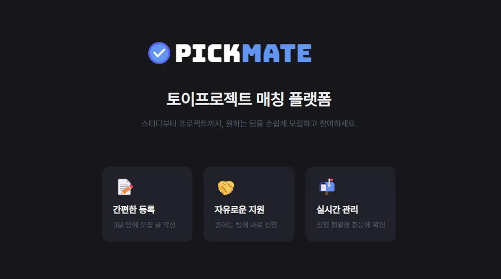

# PickMate

토이프로젝트 매칭 플랫폼

## 📅 개발 기간

2025.03 ~ 개발 진행 중 | 팀 프로젝트 (2명)

## 🛠️ 기술 스택

- **프론트**: Next.js Page Router, React, Typescript, pnpm, Tailwind CSS, axios, eslint, prettier, vercel
- **백엔드**: Java, MySQL, postman

## ✨ 주요 기능

### 1️⃣ 프로젝트/스터디 게시글 그림 (CRUD)

- 제목, 기술스택, 설명, 마감일 등을 입력
- 바로 수정 및 삭제 가능
- 메인 페이지 또는 마이페이지에서 확인

### 2️⃣ 프로젝트/스터디 신청 및 상황 확인

- 다른 유저가 작성한 게시물에 신청 가능
- 신청 시 메세지 입력
- 신청 후 게시물 작성자에게 알림 전달
- 신청자는 마이페이지에서 신청 상황 확인 가능 (`대기중`, `수락됨`, `거절됨`)

### 3️⃣ 검색 및 카테고리별 게시글 필터링

- 프로젝트/스터디 게시글을 검색하고 카테고리별로 필터링

### 4️⃣ 마이페이지

- 로그인 후 마이페이지 조회 가능
- 내가 작성한 게시물 및 신청한 게시물 확인 가능

### 5️⃣ 신청자 관리

- 발작자는 내가 등록한 게시물에서 신청자 목록 확인 가능
- 신청자는 `대기중` 상황으로 표시
- 발작자는 각 신청에 대해 **수락/거절** 가능
  - **수락 시**: 오픈채팅뱅 링크 입력 후 대상방에게 전달
  - **거절 시**: `거절됨` 상황이 신청에 표시
